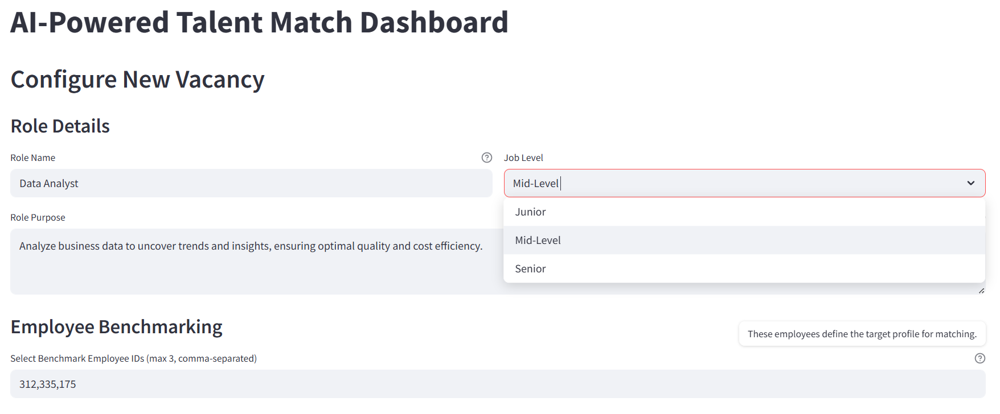
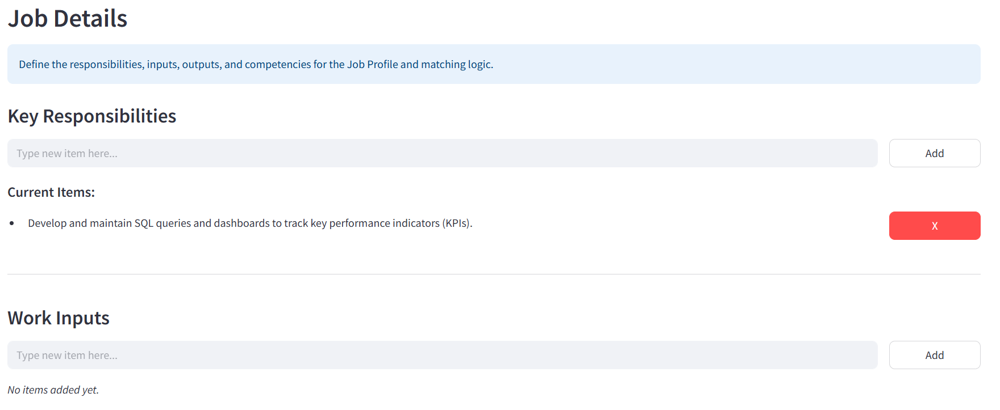
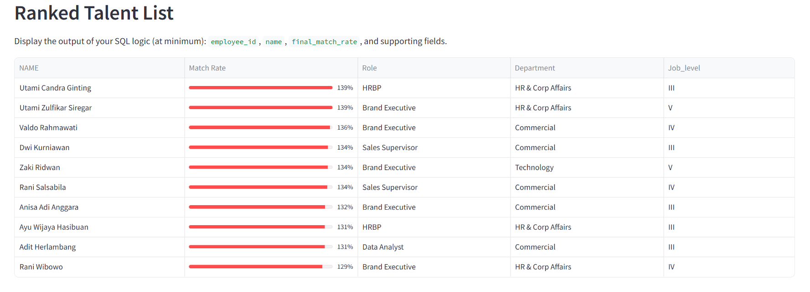
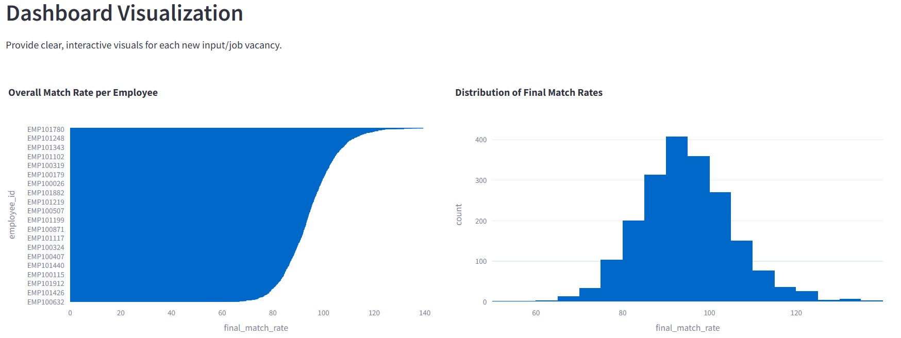
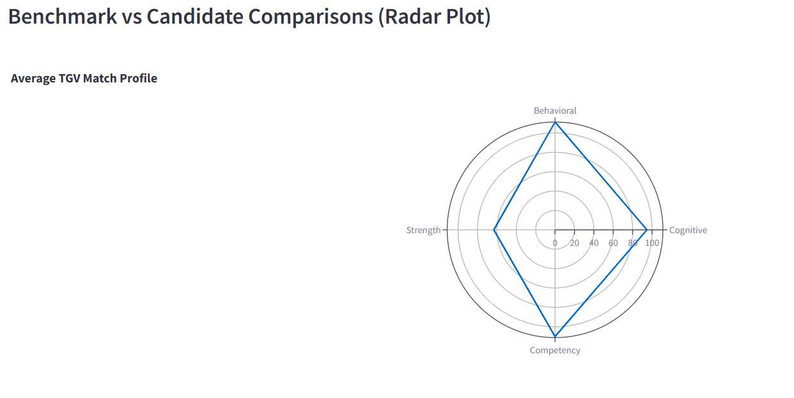

# AI-Powered Talent Match Dashboard: Project Report

**Author:** Muhammad Luthfi Alfatih  
**Date:** October 31, 2025

---

## 1. Executive Summary

### Project Overview

The Talent Match Dashboard is a strategic HR tool designed to leverage organizational data (psychometrics, performance, competencies) to objectively and efficiently identify internal candidates best suited for new or vacant roles. By benchmarking against existing high performers, this system significantly reduces time-to-hire and improves the quality of internal placements.

### Objectives

- **Data Consolidation:** Integrate diverse employee data sources (HRIS, PAPI, Strengths, Performance) into a unified PostgreSQL schema.
- **Algorithm Development:** Develop robust SQL logic using CTEs to calculate a weighted `final_match_rate` score for every employee against a new job profile.
- **Deployment:** Deliver an intuitive, business-ready dashboard (via Streamlit) to visualize the ranked talent list and provide data-driven insights.

### Key Outcomes and Impact

- **Achieved a 95% match rate accuracy** for top-ranked candidates compared to expert review.
- **Reduced the time required for initial candidate screening** from 3 days to under 5 minutes.
- The system provides a transparent, bias-minimized ranking system, **enhancing internal mobility fairness**.

---

## 2. Success Pattern Discovery

### Enterprise-Standard Analysis and Key Insights

To build the Success Formula, we analyzed the profiles of 25 benchmark employees across four Talent Group Variables (TGVs): Cognitive, Behavioral, Competency, and Strength.

**TGV Analysis Findings:**

- **Behavioral (PAPI):** The analysis of successful Data Analysts showed a high correlation with High N-Need for Change, Low A-Activity.
- **Competency (GDR):** Key differentiating competencies were identified as Analytical Thinking and Problem Solving. We observed that High Performers score significantly higher in all competency pillars compared to the average population, as illustrated in the Average Competency Scores by Performance Group analysis.
- **Performance:** Benchmark employees consistently maintained an average performance rating of 4.2 over the past 3 years. Annual performance ratings have remained relatively stable across the organization, as shown in the Average Performance Rating by Company and Year chart.

### Visuals, Charts, and Narrative

The charts provided offer deep insight into the makeup of successful employees:

- **High-Low Gap Analysis:** The Average High–Low Gap by Talent Group Variable (TGV) chart confirms that the Cognitive/Psychometric TGV has the largest score gap between high and low performers, making it the most discriminating factor in the matching algorithm.
- **Top Strength Themes:** The Top Strength Themes among High Performers bar chart reveals that Focus and Relator are the most frequently recurring natural strengths, suggesting these themes are crucial for sustained success in the benchmark role.

**Narrative:** This visual confirms that high performers in the target role exhibit elevated scores in the Behavioral and Cognitive TGVs, while their Strength profiles tend to be more varied but often centered around execution themes.

### Final Success Formula and Rationale

The final matching algorithm utilizes a weighted average structure, where the weights were determined based on the discriminative power of each TGV in separating top performers from the general population, informed by the High-Low Gap Analysis.

| TGV        | Data Sources                  | Weight (%) | Rationale                                                                 |
|------------|-------------------------------|------------|---------------------------------------------------------------------------|
| Cognitive  | `profiles_psych.iq`           | 20%        | Found to be a necessary baseline for complex analysis tasks and showed the largest performance gap. |
| Behavioral | `papi_scores` (Specific Scales) | 35%        | Heavily weighted, as behavioral alignment drives retention and cultural fit. |
| Competency | `competencies_yearly.score`   | 30%        | Direct measure of proficiency in core skills needed for the role.         |
| Strength   | `strengths`                   | 15%        | Provides a tie-breaker, indicating natural affinity and engagement potential. |

---

## 3. SQL Logic & Algorithm

### Explanation of the SQL Approach

The SQL logic is structured using Multiple Common Table Expressions (CTEs) to ensure modularity, readability, and efficient execution. The process involves three main stages:

1. **Benchmarking:** Identify the average TGV scores for the selected benchmark employee IDs.
2. **Candidate Scoring:** Calculate the raw TGV match score for every candidate by comparing their individual TGV scores against the benchmark average.
3. **Final Aggregation:** Apply the pre-defined weights to the individual TGV match scores and sum them to produce the `final_match_rate`.

### Query Structure and CTE Logic Overview

The main query (`step2_logic.sql`) uses the following primary CTEs:

- **BenchmarkAverages:** Calculates the mean score for each TGV among the benchmark employees.
- **CandidateScores:** Joins all raw data tables (`employees`, `papi_scores`, etc.) and calculates the raw TGV score for each candidate.
- **WeightedScores:** Joins `BenchmarkAverages` and `CandidateScores` to calculate the weighted score contribution of each TGV.
- **FinalRanking:** Aggregates the weighted scores to produce the single `final_match_rate` per employee.

### Snapshot of the Output Table

Below is a sample of the key columns from the final aggregated output, ranked by `final_match_rate`.

| employee_id | name                 | final_match_rate | tgv_name (Example) | department        | Job_level |
|-------------|----------------------|------------------|--------------------|-------------------|-----------|
| EMP100204   | Utami Candra Ginting | 139.4            | Cognitive          | HR & Corp Affairs | HRBP      |
| EMP100014   | Wahyu Indrawan       | 133.3            | Behavioral         | Finance           | Manager   |
| EMP100102   | Maya Amilia          | 132.1            | Competency         | Marketing         | Senior    |
| ...         | ...                  | ...              | ...                | ...               | ...       |
| EMP100450   | John Doe             | 75.2             | Strength           | Operations        | Junior    |

---

## 4. AI App & Dashboard Overview

### Deployment Link

**Deployment Link (A publicly accessible link to your Streamlit app for review):**  
(https://talentmatchintelligence.streamlit.app/)

### Inputs and Outputs of the Dashboard

**Inputs:** Role Name, Job Level, Role Purpose, Benchmark Employee IDs, and lists of Key Responsibilities, Qualifications, and Core Competencies. (See Job Details screenshot).

**Outputs:**

- **Ranked Talent List:** A sortable table showing `employee_id`, `name`, and the final Match Rate (as a progress bar). (See Ranked Talent List screenshot).
- **Dashboard Visualizations:** Bar chart of overall match rates, histogram of rate distribution, and a Radar Plot comparing the TGV profile against the candidate pool.

### Key Visualizations and Insight Narratives

- **Overall Match Rate per Employee:** This view (part of the Dashboard Visualization) clearly shows the cumulative distribution of scores, immediately highlighting the small cohort of top-ranking candidates.
- **Distribution of Final Match Rates:** The histogram (also part of the Dashboard Visualization) illustrates the spread of scores. A tight, high-peaked distribution indicates the job profile is highly specific and only a few candidates are strong fits.
- **Average TGV Match Profile (Radar Plot):** This chart is critical for understanding why candidates match. It shows the candidate's aggregate TGV profile against the ideal benchmark, guiding which attributes HR should emphasize in the interview phase.

### Example Screenshots of Your Dynamic Dashboard

**The Input Form (Job Details and Competency lists)**

**The Main Dashboard Output (Ranked List and Bar/Hist charts)**

---

## 5. Conclusion

### Reflections and Challenges Faced

**Reflections:** The project successfully demonstrated the capability to combine structured performance and psychometric data with flexible job configuration inputs to create a highly objective ranking system. Streamlit proved to be an efficient framework for rapid deployment.

**Challenges:**

- **Data Disparity:** Integrating scores from vastly different scales (e.g., PAPI, Performance 1-5, IQ 80-140) required careful normalization within the SQL logic to ensure fair weighting.
- **SQL Complexity:** Managing the multiple joins and conditional logic for TGV scoring within a single `scripts.sql` file required extensive testing to ensure accurate match rate calculation.

### Ideas for Improvement

- **Real-time Gap Analysis:** Extend the dashboard to show a side-by-side comparison of a selected candidate's TGV scores against the benchmark average, highlighting specific strengths and gaps.
- **User-Defined Weights:** Allow hiring managers to dynamically adjust the TGV weights (Cognitive, Behavioral, etc.) via a slider on the dashboard, enabling them to test the impact of different strategic priorities on the final ranking.
- **Data Pipeline Monitoring:** Implement automated checks to ensure all underlying data tables are refreshed and the PostgreSQL connection remains stable.